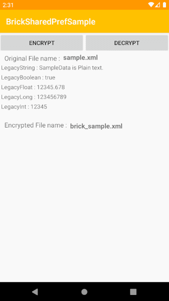
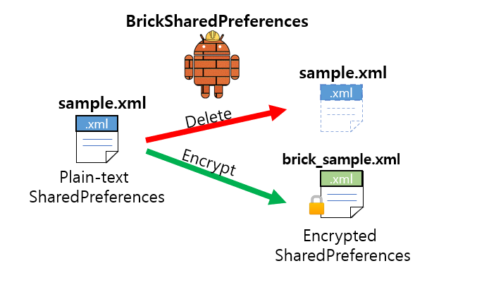

🧱 BrickSharedPreferences
===================================


🔒 EncryptedSharedPreferences Migration Support Library For Android.

# Introduce

Simple way to keep your SharedPreferences secure and safe.

Support migration legacy SharedPreferences to EncryptedSharedPreferences.

- **Require minSdk 14.**

# How To Use


## Installation

Add the following dependency to your `build.gradle` file:

```
dependencies {
    implementation 'dev.haenara:bricksharedpref:1.0.2'
    implementation "androidx.security:security-crypto:1.0.0-alpha02"
}
```

## How to Migrate

When you encrypt existing plain-text data and get rid of legacy plain-text data, follow this method:
```
BrickSharedPreferences.migrateEncryptedSharedPreferences()
```
And all is done! 🎉

## How to Access EncryptedSharedPreferences

After migration, use a BrickSharedPreferences instance instead of SharedPreferences.

All you have to do is changing codes like this:  

### Kotlin

```
// Only difference is adding "Brick" when you get SharedPreferences. 
mSharedPreferences = context.getBrickSharedPreferences(fileName, Context.MODE_PRIVATE)
```

### Java

```
mSharedPreferences = new BrickSharedPreferences(context, fileName);
```
And all is done! 🎉


# Sample Run



Sample app shows how BrickSharedPreferences works.


# Hot it works



BrickSharedPreferences deletes the legacy SharedPreferences file, and copies and encrypts as a new file name start with  "brick_".

After migration, just use a BrickSharedPreferences instance instead of SharedPreferences.


# Licences

```
MIT License

Copyright (c) 2019 Haenala Shin

Permission is hereby granted, free of charge, to any person obtaining a copy
of this software and associated documentation files (the "Software"), to deal
in the Software without restriction, including without limitation the rights
to use, copy, modify, merge, publish, distribute, sublicense, and/or sell
copies of the Software, and to permit persons to whom the Software is
furnished to do so, subject to the following conditions:

The above copyright notice and this permission notice shall be included in all
copies or substantial portions of the Software.

THE SOFTWARE IS PROVIDED "AS IS", WITHOUT WARRANTY OF ANY KIND, EXPRESS OR
IMPLIED, INCLUDING BUT NOT LIMITED TO THE WARRANTIES OF MERCHANTABILITY,
FITNESS FOR A PARTICULAR PURPOSE AND NONINFRINGEMENT. IN NO EVENT SHALL THE
AUTHORS OR COPYRIGHT HOLDERS BE LIABLE FOR ANY CLAIM, DAMAGES OR OTHER
LIABILITY, WHETHER IN AN ACTION OF CONTRACT, TORT OR OTHERWISE, ARISING FROM,
OUT OF OR IN CONNECTION WITH THE SOFTWARE OR THE USE OR OTHER DEALINGS IN THE
SOFTWARE.

```
